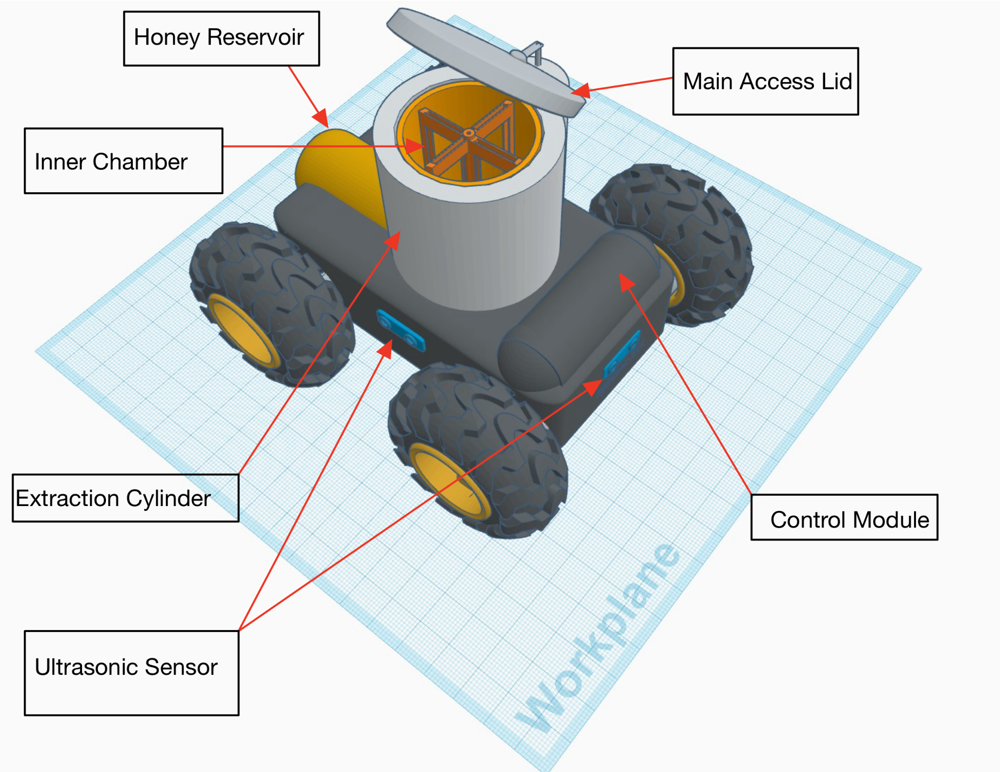

# Spinner Bot

### Embedded control for a robotic honey extraction concept

**Jason Henry · Arizona State University · FSE 100: Introduction to Engineering · Fall A 2023**

I designed the Spinner Bot for **The Ohm-lettes**, a five-person team developing a coordinated robotic honey harvesting concept. My responsibility was the extraction robot: its mechanical layout, Arduino circuits, and control code for the spinning chamber and mobile base.

This repository presents my CAD design, two original Arduino sketches, and Tinkercad circuit simulations. The work connects sensor inputs, actuator control, and robot-to-robot interfaces within a larger team system.

[Chamber code](firmware/spinner_bot_v11/spinner_bot_v11.ino) · [Movement code](firmware/spinner_bot_v12/spinner_bot_v12.ino) · [Code and electronics guide](docs/engineering.md) · [Original presentation](docs/spinner-bot-presentation.pdf)

## The problem our team chose

Our team explored how specialized robots could reduce manual handling and beekeepers' exposure to stings. We divided harvesting into five tasks: smoking the hive, lifting hive sections, fetching and uncapping frames, extracting honey, and collecting it. Bee safety and process efficiency led our design priorities.

My bot sat between the **Fetcher**, which supplied prepared frames, and the **Container**, which collected honey. The Fetcher needed access to the chamber; the Container needed a reachable docking connection and honey-level information.

## What I designed and implemented

| Area | My contribution |
| --- | --- |
| Mechanical design | Four-wheel chassis, extraction cylinder, frame holder, access lid, reservoir, and docking coupler within a 24 × 18 × 14 inch concept envelope. |
| Chamber electronics | An Arduino Uno simulation with one ultrasonic sensor, a lid servo, and a DC motor representing the spinning mechanism. |
| Embedded control | Arduino C++ functions for sensing, lid actuation, motor control, a three-minute spin timer, and status reporting. |
| Mobility | Three ultrasonic sensors, four DC motors, and two L293D drivers; clearance measurements select forward motion, reverse, or a pivot turn. |
| Team interfaces | Serial command handling using the team's shared vocabulary for readiness, docking, honey levels, and extraction status. |

## Why the design took this shape

**The extraction mechanism followed the task.** The radial extractor concept holds frames inside a cylindrical chamber and spins them to separate honey into a reservoir. The lid provides access for the Fetcher. Our proposal also included a false floor to separate wax from liquid honey.

**The docking position followed the team layout.** Our proposal placed the outlet facing away from the hive, giving the Container an approach clear of the other robots. It specified a spring-centered coupler with 10–30 degrees of angular compliance for alignment variation. These were mechanical design intentions; the CAD shows the docking interface.

**Extraction and movement have separate simulations.** Each has its own circuit and sketch. The chamber uses a stored start time and `millis()` to manage the spin interval while continuing through its control loop. The mobile base compares three distances to select a maneuver.

**The implementation refined the proposal.** The proposal described liquid-level sensing and a servo-operated transfer valve. In the final chamber simulation, an ultrasonic sensor represents honey level and the servo operates the lid. Valve and docking messages represent team coordination; the chamber sketch does not actuate a transfer valve.

## How the code supports the design

- **Chamber:** commands open/close the lid and start/stop the motor. Elapsed time limits the spin cycle; distance thresholds generate honey-level messages.
- **Movement:** front clearance above 15 inches permits forward motion. Otherwise, the bot reverses and pivots toward greater side clearance. Serial commands pause and resume travel.
- **Coordination:** manually entered serial messages represent communication between robots, as required by the course.

The [engineering guide](docs/engineering.md) explains the functions, pins, commands, timing, and component principles, with Arduino and device-datasheet references. Both `.ino` files retain the original project code.

## Project outcome and next steps

The completed school work includes a CAD concept, two circuit simulations, control code, and a presentation. It demonstrates requirements breakdown, sensor and actuator integration, modular programming, and team coordination. Physical extraction performance, battery endurance, and field reliability were outside this simulation project.

A next iteration would add a rated motor power stage, lid feedback and an interlock, missing-echo handling, and a shared command format. Current, response-time, and cycle measurements would then provide a stronger basis for evaluating the design.

## Team

| Team member | Robot responsibility |
| --- | --- |
| Orvin Atischand | Smoker |
| Leo Andrade | Lifter |
| Benjamin Gravelle | Fetcher |
| **Jason Henry** | **Spinner** |
| Scott Tuominen | Container |

The overall concept and coordination plan were team work. The [Spinner Bot presentation excerpt](docs/spinner-bot-presentation.pdf) includes my mechanical views, circuits, code, activity diagram, and recorded-demo link.
