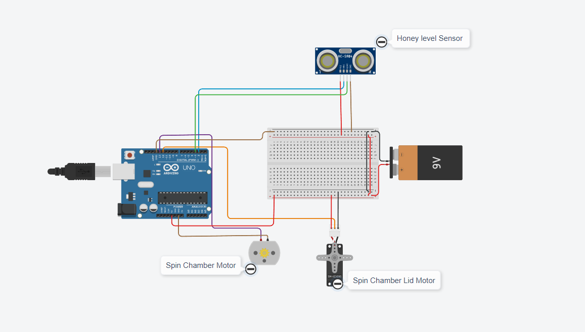
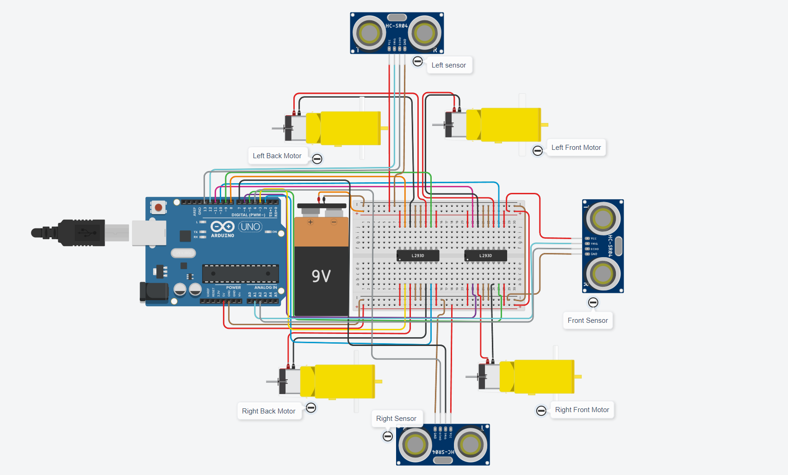
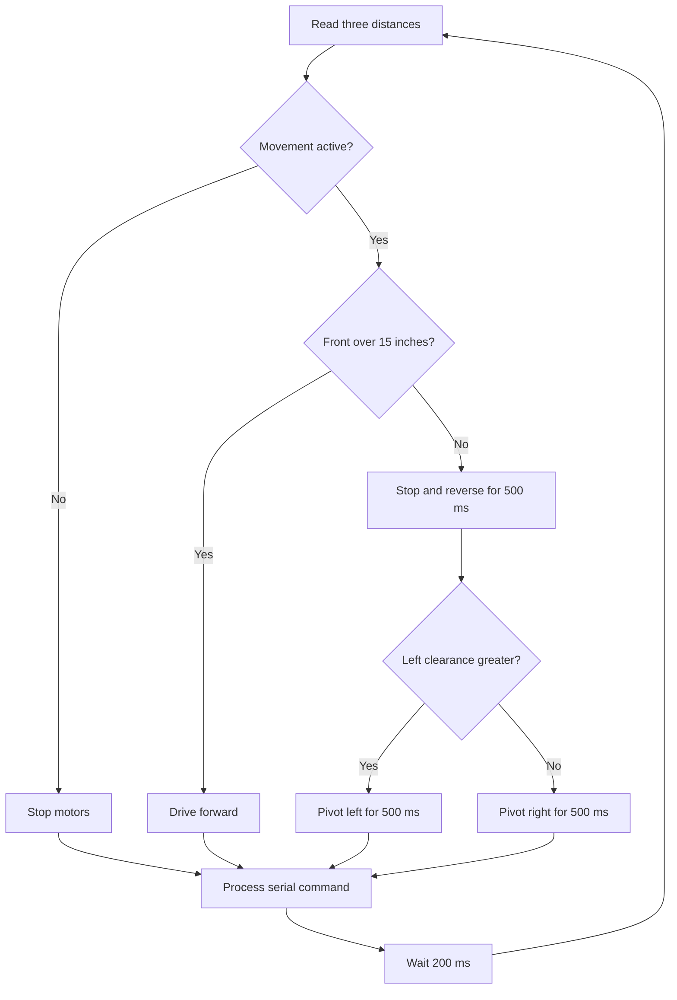

# Spinner Bot: code and electronics

[Back to the project](../README.md)

The Spinner Bot has two separate Arduino Uno simulations. The filenames `v11` and `v12` identify the original files: **v11 controls the chamber; v12 controls movement.** They implement different subsystems and use different pin assignments.

| Sketch | Inputs | Outputs |
| --- | --- | --- |
| [spinner_bot_v11.ino](../firmware/spinner_bot_v11/spinner_bot_v11.ino) | One ultrasonic sensor and serial commands | Spin motor control, lid servo, serial status |
| [spinner_bot_v12.ino](../firmware/spinner_bot_v12/spinner_bot_v12.ino) | Left, front, and right ultrasonic sensors; serial commands | Direction signals for four wheel motors; serial status |

## How the programs are organized

Both sketches follow Arduino's `setup()` / `loop()` model: initialization runs once at startup, then the control loop repeats. The organization separates hardware configuration, stored state, sensing, and actions. See the [Arduino programming reference](https://docs.arduino.cc/learn/programming/reference/).

| Code component | Purpose in this project |
| --- | --- |
| Constants | Give names to I/O pins, distance thresholds, servo positions, and the spin duration, keeping configuration separate from behavior. |
| State variables | `isSpinning` tracks chamber operation; `robotActive` enables or pauses movement. Timestamp variables retain timing information between loop iterations. |
| `setup()` | Starts serial communication at 9600 baud and configures input/output pins. The chamber also attaches the servo and commands the lid closed. |
| `measureDistance()` | Sends the ultrasonic trigger pulse, measures the echo, and converts travel time into distance. The movement version takes pin arguments so the same function serves all three sensors. |
| Actuator functions | Names such as `openDoor()`, `startSpinCycle()`, and `turnLeft()` express an action while containing the lower-level pin writes. |
| `loop()` | Combines readings, elapsed time, stored state, and received commands to decide what to do next. |
| Serial interface | Accepts demonstration commands and prints status that makes the control behavior observable. |

## Extraction chamber



*Original school simulation: ultrasonic level sensing, a lid servo, and a motor representing the extractor. The physical power-stage changes described below are needed before building this circuit.*

### Sensing the honey level

The HC-SR04 represents a noncontact level sensor in the simulation. A shorter measured gap represents a higher liquid surface. `measureDistance()` sends a 10 µs trigger pulse and reads the echo with `pulseIn()`.

The distance conversion is approximately:

```text
distance_cm = echo_duration_us / (2 × 29.1)
```

The echo travels to the target and back, which accounts for the factor of two. The conversion uses an approximate speed of sound. The [HC-SR04 datasheet](https://cdn.sparkfun.com/datasheets/Sensors/Proximity/HCSR04.pdf) describes the trigger/echo measurement principle. Actual honey-level measurement would also require appropriate sensor mounting and checks for surface motion, foam, and contamination.

| Measured gap | What the sketch reports |
| --- | --- |
| At or below 5 cm | `HoneyLevelHigh` |
| Above 5 cm and below 10 cm | Distance only; no new high/low message |
| At or above 10 cm | `HoneyLevelLow` |

The code stores whole-number distances. Its two thresholds leave a middle band, but there is no stored high/low state implementing hysteresis. These distances are project settings, not measured reservoir capacities.

### Motor timing and lid control

`startSpinCycle()` turns the motor control output on, sets `isSpinning`, and records `millis()`. A repeat start while already spinning leaves the existing start time intact. Each loop checks:

```cpp
if (isSpinning && (millis() - spinCycleStartTime >= SPIN_CYCLE_DURATION)) {
    stopSpinCycle();
}
```

`SPIN_CYCLE_DURATION` is 180,000 ms. This elapsed-time approach lets the loop continue processing commands during the three-minute interval. It is the same timing principle documented by Arduino for [`millis()`](https://docs.arduino.cc/language-reference/en/functions/time/millis/). The code also reports elapsed spin time on a five-second reporting interval.

The overall loop still includes a 200 ms delay, sensor waits, and 500 ms delays after lid commands, so actions occur at loop boundaries rather than with a guaranteed real-time deadline. The three-minute setting is a control parameter, not an experimentally optimized extraction time.

`Servo.h` supplies `attach()` and `write()`. The lid commands request 90° for open and 0° for closed. These are commanded positions; they do not confirm that the physical lid has reached them. See the [official Servo API](https://github.com/arduino-libraries/Servo/blob/master/docs/api.md).

### Chamber commands

Use **9600 baud** and **No line ending** when entering one command at a time. The parser uses `Serial.read()`, so an added newline is another character and produces `Unknown command`.

| Command | Behavior in the original sketch |
| --- | --- |
| `z` | Prints `ChamberOpen`; commands the servo to 90°. |
| `q` | Prints `ChamberClose`; commands the servo to 0°. |
| `n` | Prints `SpinCycleOn`; starts the motor and timer if idle. |
| `x` | Prints `SpinCycleOff`; stops the motor if spinning. |
| `c` | Prints `DockingComplete`. |
| `d` | Prints `DockingReady`. |
| `f` | Prints `Full`. |
| `h` | Prints `HoneyLevelHigh`. |
| `l` | Prints `HoneyLevelLow`. |
| `p` | Prints `ValueOpen`, the spelling used in the team's command table and original code. |
| `v` | Prints `ValveClosed`. |
| `r` | Prints `Hive,ID,Ready`. |

The last eight commands report messages without changing a physical output in this sketch. Honey-level messages are also generated from sensor readings. Docking, valve operation, and the complete frame-handling sequence in the activity diagram remain part of the team coordination concept.

### Chamber pin assignments

| Signal | Uno pin |
| --- | --- |
| Ultrasonic trigger / echo | D2 / D3 |
| Spin motor control | D13 |
| Lid servo signal | D12 |

## Mobile base



### Sensor-guided motion

The movement sketch reads the left, front, and right sensors, then uses a simple reactive rule. Distances are converted from centimeters to whole inches before comparison.



Equal side readings choose the right-hand branch. The turn time defines how long the motors are driven, not a measured turn angle. Motor outputs stay in their last commanded state until another function changes them. There are no encoders or wheel-speed feedback in this version.

### Driving four motors

Each motor has a forward and backward control signal. The two L293D chips provide four H-bridges in total, enabling the polarity across each motor to be reversed. The sketch uses digital direction commands, with no PWM speed-control routine.

| Function | Left motors | Right motors |
| --- | --- | --- |
| `forward()` | Forward | Forward |
| `reverse()` | Reverse | Reverse |
| `turnLeft()` | Reverse | Forward |
| `turnRight()` | Forward | Reverse |
| `stopRobot()` | Both control inputs LOW | Both control inputs LOW |

The [Texas Instruments L293D documentation](https://www.ti.com/product/L293D) specifies bidirectional drive, separate logic and load supplies, and internal output clamp diodes. Its 600 mA per-channel rating is a component limit; a physical design must also account for motor stall current, driver voltage drop, and thermal dissipation.

### Movement pins and commands

| Signal pair | Uno pins |
| --- | --- |
| Left front: forward / backward | D10 / D11 |
| Left rear: forward / backward | D9 / D8 |
| Right front: forward / backward | D6 / D5 |
| Right rear: forward / backward | D3 / D2 |
| Left ultrasonic: trigger / echo | D12 / D13 |
| Front ultrasonic: trigger / echo | A1 / A2, used as digital I/O |
| Right ultrasonic: trigger / echo | D7 / D4 |

Use **9600 baud** and **Newline** for this sketch. It uses `Serial.readStringUntil('\n')`, then trims the received string.

| Command | Behavior |
| --- | --- |
| `r` | Prints `Hive,ID,Ready`; sets `robotActive` false. The next movement decision stops the motors. |
| `k` | Prints `Honey_Extraction_Complete`; sets `robotActive` true. |
| `d` | Prints `DockingReady`; leaves the movement state unchanged. |

Movement starts active. Commands are processed after the sensing and movement decision, so a pause can be delayed by the current sensor reads or maneuver. The two sketches also use different serial parsers; a future integrated controller would need one consistent message format.

## Exploring the original simulations

Open each sketch separately in Arduino IDE, select **Arduino Uno**, and use **Verify** to compile it. The chamber needs the **Servo** library; the movement sketch has no external library dependency. Keep each `.ino` inside its matching folder as provided.

For Tinkercad, use the corresponding original circuit project and paste the matching sketch into its text editor. The images here document the circuits; they are not editable Tinkercad project exports. The [original presentation](spinner-bot-presentation.pdf) includes the recorded-demo link, whose access is controlled by the original Google Drive owner.

Suggested simulation walkthrough, with expected behavior derived from the code:

1. **Chamber:** send `z`, then `q`, and observe the servo commands. Send `n` and observe motor operation; send `x` to stop, or let the timer reach three minutes.
2. **Level sensing:** move the simulated target to 4 cm, 7 cm, and 12 cm to exercise high, middle-band, and low readings.
3. **Movement:** set front clearance above 15 inches, then below it. Change the left/right clearances to select each pivot direction. Send `r` and `k` to pause and resume.

## Engineering improvements for a physical iteration

These are proposed follow-on changes, beyond the original school implementation.

- **Power design:** replace the chamber's direct GPIO-to-motor connection with a rated motor driver or transistor stage and inductive protection. Separate regulated logic/servo power from the motor supply as needed, with a common signal reference. Select supplies and drivers from measured operating and stall currents. Arduino's [motor-control guidance](https://docs.arduino.cc/learn/electronics/transistor-motor-control/) explains the switching stage and flyback diode.
- **Interlocks and scheduling:** add lid-position feedback and permit spinning only with the lid confirmed closed. Replace movement delays with explicit timed states so stop requests can be handled promptly; define behavior when communication is lost.
- **Sensor validity:** treat a missing echo as an invalid reading. Arduino documents that [`pulseIn()`](https://docs.arduino.cc/language-reference/en/functions/advanced-io/pulseIn/) returns zero on timeout. The chamber currently converts that into a high-level indication; movement treats it as zero clearance. Add bounded sensor waits, filtering, and measured threshold calibration.
- **Measured verification:** record motor current, spin timing, sensor error, command response time, and repeatability before claiming hardware performance. Check the shared docking and transfer sequence with the Container interface. These measurements would turn the next revision into a stronger engineering demonstration.

The project brings together electrical I/O, software decisions, mechanical access, and team interfaces. Keeping those interfaces explicit makes each subsystem easier to understand and gives the next design iteration concrete questions to resolve.
